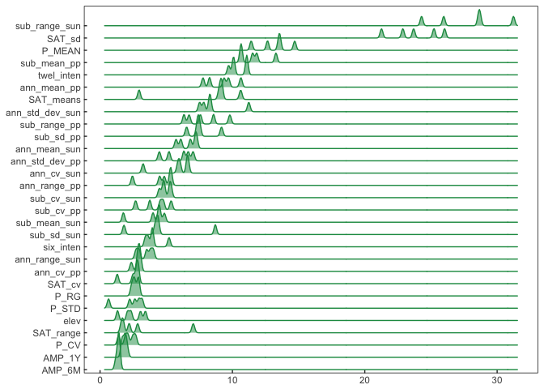
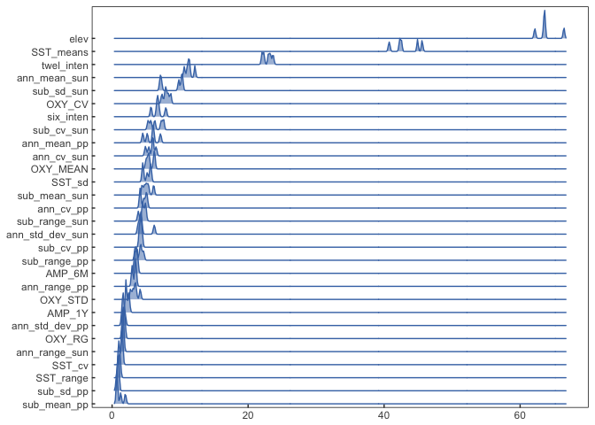
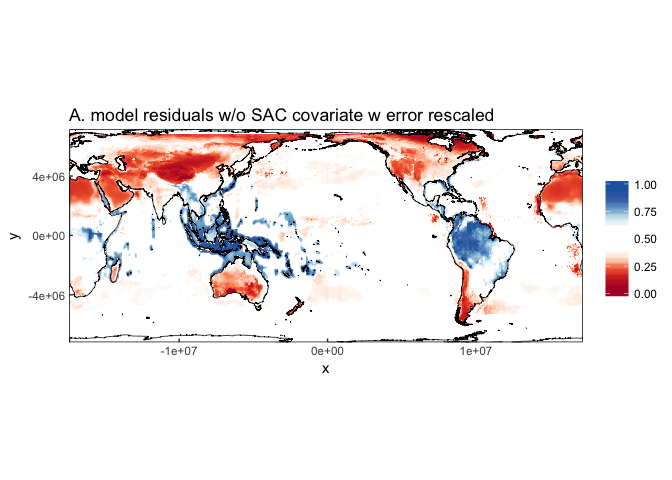

ANN\_sensitivity.R
================
Tyler Gagne
Spring 2018

``` r
# This is a draft script of a sensitivity analysis of variable importance
# We utilize the variable perturbation methodlogy as a means to test variable importance

# Under repeated ANN training rounds of weighting coefficients on random subsets of the training data
# we get a distribution of feature importance rankings that better approximate the stochastic range of
# feature importance approximation.

# load relevant libraries
library(ggridges)
library(mxnet)
library(caret)
library(dplyr)
library(reshape2)

``` r
library(rgdal)
```

    ## Warning: package 'rgdal' was built under R version 3.4.4

    ## Loading required package: sp

    ## Warning: package 'sp' was built under R version 3.4.1

    ## rgdal: version: 1.2-18, (SVN revision 718)
    ##  Geospatial Data Abstraction Library extensions to R successfully loaded
    ##  Loaded GDAL runtime: GDAL 2.1.3, released 2017/20/01
    ##  Path to GDAL shared files: /Library/Frameworks/R.framework/Versions/3.4/Resources/library/rgdal/gdal
    ##  GDAL binary built with GEOS: FALSE 
    ##  Loaded PROJ.4 runtime: Rel. 4.9.3, 15 August 2016, [PJ_VERSION: 493]
    ##  Path to PROJ.4 shared files: /Library/Frameworks/R.framework/Versions/3.4/Resources/library/rgdal/proj
    ##  Linking to sp version: 1.2-7

``` r
library(broom)

##############################
###  Custom ggPlot theme   ###
##############################
themeo <-theme_classic()+
  theme(strip.background = element_blank(),
        axis.line = element_blank(),
        axis.text.x = element_text(margin = margin( 0.2, unit = "cm")),
        axis.text.y = element_text(margin = margin(c(1, 0.2), unit = "cm")),
        axis.ticks.length=unit(-0.1, "cm"),
        panel.border = element_rect(colour = "black", fill=NA, size=.5),
        legend.title=element_blank(),
        strip.text=element_text(hjust=0)
  )

#load data
load('../data/example.RData')
# Equal Area projection with Pacific Ocean centered meridian
countries_df <- readOGR(dsn = "../data/country_repro1", layer = "ocean_50m") %>% tidy() 
```

    ## OGR data source with driver: ESRI Shapefile 
    ## Source: "/Users/tgagne/example_repo/data/country_repro1", layer: "ocean_50m"
    ## with 1420 features
    ## It has 3 fields
    ## Integer64 fields read as strings:  scalerank

    ## Regions defined for each Polygons

``` r
#########################
# Neural network build: #
#########################

# establish hyper parameters of MXnet ANN, these are drawn from an earlier training script, Keras version available
method_mod <- 'mxnet'
numFolds <- trainControl(method = 'none')   

tuneGrid <- expand.grid(
  layer1 = 10
  ,layer2 = 10
  ,layer3 = 10
  ,learning.rate = 0.02
  ,momentum = 0.9
  ,dropout = .2
  ,activation = "relu"
)

# This function takes a model object, pertubs each feature uniformily random and records the drop in 
# RMSE and R^2
Perturbed_Importance_sim <- 
  function(model_object,test_data,response_var,variable_names, scaled = F){
    
    # test set split fit metrics
    actual    <- test_data[response_var]
    predicted <- predict(model_object, test_data)
    #test_RMSE <- sqrt(mean((actual - predicted)^2))
    test_R2   <- 1 - (sum((actual-predicted)^2)/sum((actual-mean(actual[,1]))^2)) *100
    
    var_import <- NULL   
    for(x in 1:length(variable_names)){
      TRAIN_data <- test_data
      # shuffle variable
      TRAIN_data[,variable_names[x]] <- sample(TRAIN_data[,variable_names[x]]) # introduces some instability as well, perhaps set.seed.
      #predict with trained model
      var_import$pred_var[x] <- variable_names[x]
      # calculate test RMSE with noised variable
      #var_import$pred_var_RMSE[x] <- sqrt(mean((TRAIN_data[response_var] - predict(model_object, TRAIN_data))^2))
      var_import$pred_var_R2[x]   <- 1 - (sum((TRAIN_data[response_var]-predict(model_object, TRAIN_data))^2)/
                                            sum((TRAIN_data[response_var]-mean(TRAIN_data[response_var][,1]))^2)) *100
      
    }
    
    var_import <- as.data.frame(var_import)
    #var_import$pred_var_RMSE <- test_RMSE - var_import$pred_var_RMSE
    var_import$pred_var_R2   <- test_R2   - var_import$pred_var_R2
    
    if(scaled){ 
      var_import[,2:3] <- rangisize(var_import[,2:3])
    }
    
    print(var_import)
  }


sims <- 5  # this is a very small test simulation, suggested 500+ takes approximately 2 hours, quicker in paralell

# Conducted on both terrestrial and marine datasets of species biodiversity
# Within the loop below we conduct the input perturbation measure on ANN (MXnet or Keras)
# that were trained on 80% subsets of the training data. 
# Subsequently, were able to repeat that X amount of times. From there we establish a distribution
# of feature importance values under perturbation. Such that features that exhibit a narrow distribution
# are highly confined and regular in their effect on model performance, whereas features with high spread
# in feature importance are more highly variable in their predictive performance under inclusion.

# TERRESTRIAL
sim_runs <- data.frame(pred_vars = Land_varnames)

for(i in 1:sims){
  # sample to speed workup time
  LAND_noNA  <- LAND_submission #%>% sample_n(10000, replace = T)
  # split in to test and training sets
  # create data partition for training set 
  LandInTrain  <- createDataPartition(LAND_noNA$terrestrial_richness, p=0.8,list=FALSE)
  # partion out training set
  LAND_trainer<-LAND_noNA[LandInTrain,]
  # partition out test set
  LAND_test<-LAND_noNA[-LandInTrain,]
  
  # land tune
  terre <- train(y = LAND_trainer[,"terrestrial_richness"],
                 x = LAND_trainer[,Land_varnames],
                 method     = method_mod, 
                 preProcess = c('center', 'scale'), 
                 trControl  = numFolds, 
                 tuneGrid   = tuneGrid
  )
  # note the input, by inputting land trainer, its a train/leave 20% out
  # par(mfrow=c(6,1))
  var_importN <- Perturbed_Importance_sim(terre,LAND_trainer,"terrestrial_richness",Land_varnames,scaled = F)[[2]] 
  
  sim_runs[,i+1] <- var_importN
  print(i)
}
```

    ## Start training with 1 devices

    ## [1] Train-rmse=0.16170139061066

    ## [2] Train-rmse=0.111285412319616

    ## [3] Train-rmse=0.10299722082138

    ## [4] Train-rmse=0.0978612944989191

    ## [5] Train-rmse=0.0941302784969908

    ## [6] Train-rmse=0.0909374050399774

    ## [7] Train-rmse=0.0883171283043205

    ## [8] Train-rmse=0.0866077493232512

    ## [9] Train-rmse=0.0854302598549606

    ## [10] Train-rmse=0.0845125762471731

    ##           pred_var pred_var_R2
    ## 1      ann_mean_pp   8.2724157
    ## 2   ann_std_dev_pp   4.4803568
    ## 3        ann_cv_pp   2.3626841
    ## 4     ann_range_pp   2.4481225
    ## 5        sub_sd_pp   6.5428502
    ## 6        sub_cv_pp   2.6853977
    ## 7      sub_mean_pp  10.6427076
    ## 8     sub_range_pp   8.5738191
    ## 9             elev   1.3216434
    ## 10    ann_mean_sun   6.0993530
    ## 11 ann_std_dev_sun  11.2384245
    ## 12      ann_cv_sun   3.2509181
    ## 13   ann_range_sun   3.8051972
    ## 14      sub_sd_sun   1.8085207
    ## 15      sub_cv_sun   4.8444118
    ## 16    sub_mean_sun   1.7644958
    ## 17   sub_range_sun  24.2924413
    ## 18       six_inten   3.6286057
    ## 19      twel_inten  11.0851057
    ## 20       SAT_means   2.9470279
    ## 21          SAT_sd  23.6925905
    ## 22       SAT_range   2.2016031
    ## 23          SAT_cv   1.2977164
    ## 24          P_MEAN  11.4202018
    ## 25           P_STD   0.6433879
    ## 26            P_CV   1.4031449
    ## 27            P_RG   2.9050405
    ## 28          AMP_1Y   1.6709348
    ## 29          AMP_6M   1.4553949
    ## [1] 1

    ## Start training with 1 devices

    ## [1] Train-rmse=0.163291616407627

    ## [2] Train-rmse=0.106246351230792

    ## [3] Train-rmse=0.0961114336552191

    ## [4] Train-rmse=0.0903441767532475

    ## [5] Train-rmse=0.0873018670751681

    ## [6] Train-rmse=0.0854050841678218

    ## [7] Train-rmse=0.0839234697022523

    ## [8] Train-rmse=0.0826543336366679

    ## [9] Train-rmse=0.0815233113266661

    ## [10] Train-rmse=0.0805358747816401

    ##           pred_var pred_var_R2
    ## 1      ann_mean_pp    9.372415
    ## 2   ann_std_dev_pp    5.209634
    ## 3        ann_cv_pp    2.852828
    ## 4     ann_range_pp    4.502687
    ## 5        sub_sd_pp    7.535690
    ## 6        sub_cv_pp    4.552260
    ## 7      sub_mean_pp   11.837526
    ## 8     sub_range_pp    9.805191
    ## 9             elev    2.335347
    ## 10    ann_mean_sun    6.825714
    ## 11 ann_std_dev_sun    8.258446
    ## 12      ann_cv_sun    6.648448
    ## 13   ann_range_sun    2.942125
    ## 14      sub_sd_sun    4.402627
    ## 15      sub_cv_sun    4.479822
    ## 16    sub_mean_sun    4.435002
    ## 17   sub_range_sun   28.602537
    ## 18       six_inten    3.427830
    ## 19      twel_inten   10.065750
    ## 20       SAT_means    8.998133
    ## 21          SAT_sd   22.876330
    ## 22       SAT_range    1.758755
    ## 23          SAT_cv    2.870124
    ## 24          P_MEAN   13.501176
    ## 25           P_STD    3.175943
    ## 26            P_CV    2.478095
    ## 27            P_RG    2.549615
    ## 28          AMP_1Y    1.671220
    ## 29          AMP_6M    1.406393
    ## [1] 2

    ## Start training with 1 devices

    ## [1] Train-rmse=0.159901707214111

    ## [2] Train-rmse=0.104815587953157

    ## [3] Train-rmse=0.0956155089334186

    ## [4] Train-rmse=0.0896287987350147

    ## [5] Train-rmse=0.0867298640800097

    ## [6] Train-rmse=0.085190237783397

    ## [7] Train-rmse=0.0841734765084205

    ## [8] Train-rmse=0.0833405466536484

    ## [9] Train-rmse=0.0825908362480478

    ## [10] Train-rmse=0.081887120615019

    ##           pred_var pred_var_R2
    ## 1      ann_mean_pp    9.702060
    ## 2   ann_std_dev_pp    6.331599
    ## 3        ann_cv_pp    3.043928
    ## 4     ann_range_pp    4.851975
    ## 5        sub_sd_pp    7.413430
    ## 6        sub_cv_pp    4.777653
    ## 7      sub_mean_pp   10.663855
    ## 8     sub_range_pp    6.342481
    ## 9             elev    2.085857
    ## 10    ann_mean_sun    5.740184
    ## 11 ann_std_dev_sun    8.337507
    ## 12      ann_cv_sun    6.582300
    ## 13   ann_range_sun    4.024521
    ## 14      sub_sd_sun    4.163474
    ## 15      sub_cv_sun    4.776469
    ## 16    sub_mean_sun    4.858197
    ## 17   sub_range_sun   28.713258
    ## 18       six_inten    3.958634
    ## 19      twel_inten   10.103272
    ## 20       SAT_means    9.192538
    ## 21          SAT_sd   25.227255
    ## 22       SAT_range    2.841760
    ## 23          SAT_cv    2.742022
    ## 24          P_MEAN   13.601584
    ## 25           P_STD    2.928141
    ## 26            P_CV    2.123803
    ## 27            P_RG    2.626777
    ## 28          AMP_1Y    1.902197
    ## 29          AMP_6M    1.194963
    ## [1] 3

    ## Start training with 1 devices

    ## [1] Train-rmse=0.15523997244024

    ## [2] Train-rmse=0.0996294419181449

    ## [3] Train-rmse=0.0909019515157057

    ## [4] Train-rmse=0.0872385499460428

    ## [5] Train-rmse=0.0851793297850107

    ## [6] Train-rmse=0.0837833704172166

    ## [7] Train-rmse=0.0826830572131959

    ## [8] Train-rmse=0.0817792760625538

    ## [9] Train-rmse=0.0809927560953828

    ## [10] Train-rmse=0.0802906025129315

    ##           pred_var pred_var_R2
    ## 1      ann_mean_pp   10.638317
    ## 2   ann_std_dev_pp    6.665407
    ## 3        ann_cv_pp    2.876900
    ## 4     ann_range_pp    5.315769
    ## 5        sub_sd_pp    9.177948
    ## 6        sub_cv_pp    3.759917
    ## 7      sub_mean_pp   11.528049
    ## 8     sub_range_pp    7.577877
    ## 9             elev    3.423224
    ## 10    ann_mean_sun    7.202524
    ## 11 ann_std_dev_sun    7.522199
    ## 12      ann_cv_sun    5.883217
    ## 13   ann_range_sun    3.523115
    ## 14      sub_sd_sun    8.708052
    ## 15      sub_cv_sun    5.255716
    ## 16    sub_mean_sun    4.496250
    ## 17   sub_range_sun   25.966271
    ## 18       six_inten    5.212468
    ## 19      twel_inten   11.082964
    ## 20       SAT_means   10.624151
    ## 21          SAT_sd   26.029454
    ## 22       SAT_range    7.041638
    ## 23          SAT_cv    2.854161
    ## 24          P_MEAN   14.705786
    ## 25           P_STD    2.620905
    ## 26            P_CV    1.926528
    ## 27            P_RG    2.385898
    ## 28          AMP_1Y    1.890715
    ## 29          AMP_6M    1.424214
    ## [1] 4

    ## Start training with 1 devices

    ## [1] Train-rmse=0.167061475913133

    ## [2] Train-rmse=0.107255983141381

    ## [3] Train-rmse=0.0965797948177222

    ## [4] Train-rmse=0.0913076034640996

    ## [5] Train-rmse=0.0880679947961694

    ## [6] Train-rmse=0.0857834869868575

    ## [7] Train-rmse=0.0840783861354767

    ## [8] Train-rmse=0.0827268953399674

    ## [9] Train-rmse=0.0815921635880783

    ## [10] Train-rmse=0.0806216245189175

    ##           pred_var pred_var_R2
    ## 1      ann_mean_pp    7.779451
    ## 2   ann_std_dev_pp    7.028799
    ## 3        ann_cv_pp    3.002792
    ## 4     ann_range_pp    5.351860
    ## 5        sub_sd_pp    7.346124
    ## 6        sub_cv_pp    5.367951
    ## 7      sub_mean_pp   13.288398
    ## 8     sub_range_pp    6.727689
    ## 9             elev    3.054487
    ## 10    ann_mean_sun    7.292807
    ## 11 ann_std_dev_sun    7.835769
    ## 12      ann_cv_sun    6.036870
    ## 13   ann_range_sun    2.720293
    ## 14      sub_sd_sun    4.329996
    ## 15      sub_cv_sun    5.357458
    ## 16    sub_mean_sun    4.002730
    ## 17   sub_range_sun   31.234020
    ## 18       six_inten    3.938794
    ## 19      twel_inten    9.712152
    ## 20       SAT_means    9.162039
    ## 21          SAT_sd   21.264575
    ## 22       SAT_range    1.612269
    ## 23          SAT_cv    2.489807
    ## 24          P_MEAN   12.651682
    ## 25           P_STD    2.242025
    ## 26            P_CV    2.689539
    ## 27            P_RG    2.887409
    ## 28          AMP_1Y    2.044232
    ## 29          AMP_6M    1.388961
    ## [1] 5

``` r
sim_joy <- melt(sim_runs)
```

    ## Using pred_vars as id variables

``` r
prov_levels <- sim_joy %>%               # Reorder levels by mean importance of feature 
  dplyr::select(value,pred_vars) %>%
  dplyr::group_by(pred_vars) %>%
  dplyr::mutate(median_of_R2 = median(value))
prov_levels<- data.frame(prov_levels)
levels <- unique(prov_levels$pred_vars[order(prov_levels$median_of_R2)])

sim_joy$pred_vars<-factor(sim_joy$pred_vars, levels = levels, ordered = T)

str(LAND_trainer)
```

    ## 'data.frame':    36871 obs. of  32 variables:
    ##  $ x                   : num  -17415623 -17367423 -17319223 -17271023 -17222823 ...
    ##  $ y                   : num  6799930 6799930 6799930 6799930 6799930 ...
    ##  $ terrestrial_richness: num  0.194 0.202 0.21 0.213 0.207 ...
    ##  $ ann_mean_pp         : num  0.314 0.336 0.286 0.202 0.152 ...
    ##  $ ann_std_dev_pp      : num  0.473 0.461 0.381 0.29 0.284 ...
    ##  $ ann_cv_pp           : num  0.5 0.386 0.307 0.277 0.304 ...
    ##  $ ann_range_pp        : num  0.445 0.376 0.328 0.289 0.198 ...
    ##  $ sub_sd_pp           : num  0.793 0.797 0.773 0.802 0.846 ...
    ##  $ sub_cv_pp           : num  0.53 0.514 0.528 0.579 0.76 ...
    ##  $ sub_mean_pp         : num  0.453 0.417 0.319 0.216 0.204 ...
    ##  $ sub_range_pp        : num  0.94 0.956 0.876 0.765 0.788 ...
    ##  $ elev                : num  0.0182 0.0236 0.0587 0.0974 0.1162 ...
    ##  $ ann_mean_sun        : num  0 0 0 0 0 0 0 0 0 0 ...
    ##  $ ann_std_dev_sun     : num  0 0 0 0 0 0 0 0 0 0 ...
    ##  $ ann_cv_sun          : num  0.305 0.287 0.298 0.334 0.385 ...
    ##  $ ann_range_sun       : num  0 0 0 0 0 0 0 0 0 0 ...
    ##  $ sub_sd_sun          : num  0.723 0.697 0.684 0.665 0.649 ...
    ##  $ sub_cv_sun          : num  1 1 1 1 0.983 ...
    ##  $ sub_mean_sun        : num  0 0 0 0 0 0 0 0 0 0 ...
    ##  $ sub_range_sun       : num  0.66 0.635 0.634 0.634 0.635 ...
    ##  $ six_inten           : num  0.1132 0.1073 0.0939 0.0896 0.0932 ...
    ##  $ twel_inten          : num  0.976 0.978 0.982 0.982 0.979 ...
    ##  $ SAT_means           : num  0.388 0.371 0.352 0.313 0.294 ...
    ##  $ SAT_sd              : num  0.265 0.286 0.312 0.365 0.391 ...
    ##  $ SAT_range           : num  0.305 0.331 0.367 0.437 0.472 ...
    ##  $ SAT_cv              : num  0.606 0.611 0.626 0.723 0.806 ...
    ##  $ P_MEAN              : num  0.436 0.382 0.367 0.353 0.316 ...
    ##  $ P_STD               : num  0.244 0.188 0.174 0.164 0.139 ...
    ##  $ P_CV                : num  0.1002 0.0776 0.0751 0.0717 0.063 ...
    ##  $ P_RG                : num  0.243 0.195 0.183 0.173 0.15 ...
    ##  $ AMP_1Y              : num  0.747 0.77 0.744 0.572 0.446 ...
    ##  $ AMP_6M              : num  0.234 0.236 0.327 0.462 0.636 ...

``` r
sim_joy_land <- sim_joy

ggplot(sim_joy_land, aes(x = value, y = pred_vars)) + 
  geom_density_ridges(
                      #rel_min_height = 0.03,
                      bandwidth = .1,
                      scale = 3,
                      alpha = .5,
                      color = "#1a9850",
                      fill  = "#1a9850")+
  scale_y_discrete(expand = c(0.01, 0)) +   # will generally have to set the `expand` option
  #scale_x_continuous(limits = c(NA, .5),expand = c(0, 0)) + 
  scale_fill_cyclical(values = c("light gray", "light gray"))+
  ylab(NULL)+xlab(NULL)+
  theme(axis.text.y = element_text(size=6),
        axis.text.x = element_text(size=6))+themeo
```



``` r
#ggplot(LAND_submission,aes(x,y,fill = sub_cv_pp))+geom_raster()+coord_fixed()


#### Repeat all of the above for the marine/ocean data ####


# MARINE
sim_runs <- data.frame(pred_vars = sea_varnames)

for(i in 1:sims){
  # sample to speed workup time
  OCEAN_noNA  <- SEA_submission #%>% sample_n(10000, replace = T)
  # split in to test and training sets
  # create data partition for training set 
  OceanInTrain  <- createDataPartition(OCEAN_noNA$marine_richness, p=0.8,list=FALSE)
  # partion out training set
  OCEAN_trainer<-OCEAN_noNA[OceanInTrain,]
  # partition out test set
  OCEAN_test<-OCEAN_noNA[-OceanInTrain,]
  
  # land tune
  oceaus <- train(y = OCEAN_trainer[,"marine_richness"],
                 x = OCEAN_trainer[,sea_varnames],
                 method     = method_mod, 
                 preProcess = c('center', 'scale'), 
                 trControl  = numFolds, 
                 tuneGrid   = tuneGrid
  )
  # note the input, by inputting ocean trainer, in a way its train/leave 20% out
  var_importN <- Perturbed_Importance_sim(oceaus,OCEAN_trainer,"marine_richness",sea_varnames,scaled = F)[[2]]
  
  sim_runs[,i+1] <- var_importN
  print(i)
}
```


``` r
sim_joy <- melt(sim_runs)
```

    ## Using pred_vars as id variables

``` r
prov_levels <- sim_joy %>%               # Reorder levels by mean risk by privince 
  dplyr::select(value,pred_vars) %>%
  dplyr::group_by(pred_vars) %>%
  dplyr::mutate(median_of_R2 = median(value))
prov_levels<- data.frame(prov_levels)
levels <- unique(prov_levels$pred_vars[order(prov_levels$median_of_R2)])

sim_joy$pred_vars<-factor(sim_joy$pred_vars, levels = levels, ordered = T)

str(OCEAN_trainer)
```

    ## 'data.frame':    73155 obs. of  32 variables:
    ##  $ x              : num  -5269223 -5221023 -5172823 -5124623 -4980023 ...
    ##  $ y              : num  5715330 5715330 5715330 5715330 5715330 ...
    ##  $ marine_richness: num  0.0439 0.0434 0.0435 0.0426 0.0328 ...
    ##  $ ann_mean_pp    : num  0.973 1 1 1 1 ...
    ##  $ ann_std_dev_pp : num  1 1 1 1 0.682 ...
    ##  $ ann_cv_pp      : num  0.4275 0.3949 0.3273 0.0516 0.1066 ...
    ##  $ ann_range_pp   : num  1 1 0.945 0.692 0.496 ...
    ##  $ sub_sd_pp      : num  1 1 1 0.919 1 ...
    ##  $ sub_cv_pp      : num  0.243 0.491 0.402 0.364 0.32 ...
    ##  $ sub_mean_pp    : num  1 1 0.868 1 1 ...
    ##  $ sub_range_pp   : num  0.961 1 0.666 0.726 1 ...
    ##  $ elev           : num  0.998 0.998 0.996 1 0.999 ...
    ##  $ ann_mean_sun   : num  0.0919 0.0935 0.0907 0.0814 0.0644 ...
    ##  $ ann_std_dev_sun: num  0.15 0.146 0.149 0.156 0.175 ...
    ##  $ ann_cv_sun     : num  0.795 0.766 0.793 0.883 1 ...
    ##  $ ann_range_sun  : num  0.169 0.168 0.172 0.185 0.216 ...
    ##  $ sub_sd_sun     : num  0.745 0.762 0.758 0.746 0.729 ...
    ##  $ sub_cv_sun     : num  0.922 0.936 0.936 0.936 0.94 ...
    ##  $ sub_mean_sun   : num  0.0968 0.0986 0.0959 0.0867 0.0701 ...
    ##  $ sub_range_sun  : num  0.865 0.874 0.877 0.885 0.898 ...
    ##  $ six_inten      : num  0.0282 0.0279 0.0329 0.0451 0.0582 ...
    ##  $ twel_inten     : num  0.968 0.968 0.963 0.951 0.943 ...
    ##  $ SST_means      : num  0 0 0 0 0 0 0 0 0 0 ...
    ##  $ SST_sd         : num  1 1 1 1 0.924 ...
    ##  $ SST_range      : num  1 1 0.997 0.971 0.811 ...
    ##  $ SST_cv         : num  1 1 1 1 1 1 1 1 1 1 ...
    ##  $ OXY_MEAN       : num  1 1 1 1 1 1 1 1 1 1 ...
    ##  $ OXY_STD        : num  0.856 0.921 0.97 0.962 0.879 ...
    ##  $ OXY_CV         : num  0.409 0.438 0.458 0.448 0.394 ...
    ##  $ OXY_RG         : num  0.841 0.929 1 1 0.984 ...
    ##  $ AMP_1Y         : num  0.424 0.298 0.299 0.299 0.297 ...
    ##  $ AMP_6M         : num  0.627 0.526 0.527 0.527 0.528 ...

``` r
sim_joy_marine <- sim_joy

ggplot(sim_joy_marine, aes(x = value, y = pred_vars)) + 
  geom_density_ridges(
    #rel_min_height = 0.03,
    bandwidth = .1,
    scale = 3,
    alpha = .5,
    color = "#4575b4",
    fill = "#4575b4")+
  scale_y_discrete(expand = c(0.01, 0)) +   # will generally have to set the `expand` option
  #scale_x_continuous(limits = c(NA, .5),expand = c(0, 0)) + 
  scale_fill_cyclical(values = c("light gray", "light gray"))+
  ylab(NULL)+xlab(NULL)+
  theme(axis.text.y = element_text(size=6),
        axis.text.x = element_text(size=6))+themeo
```



``` r
#ggplot(SEA_submission,aes(x,y,fill = ann_mean_sun))+geom_raster()+coord_fixed()


##


# run this post full model build in single_file_script

# select top X# of predictors and fit model

# build partial dependency grid
str(sim_joy_land)
```

    ## 'data.frame':    145 obs. of  3 variables:
    ##  $ pred_vars: Ord.factor w/ 29 levels "AMP_6M"<"AMP_1Y"<..: 24 18 9 16 20 14 26 21 5 19 ...
    ##  $ variable : Factor w/ 5 levels "V2","V3","V4",..: 1 1 1 1 1 1 1 1 1 1 ...
    ##  $ value    : num  8.27 4.48 2.36 2.45 6.54 ...

``` r
prov_levels <- sim_joy_land %>%               # Reorder levels by mean risk by privince 
  dplyr::select(value,pred_vars) %>%
  dplyr::group_by(pred_vars) %>%
  dplyr::mutate(median_of_R2 = median(value))
prov_levels<- data.frame(prov_levels)
land_vars <- as.character(rev(unique(prov_levels$pred_vars[order(prov_levels$median_of_R2)])))[1:15]
land_vars # these are the top 15 predictors from above
```

    ##  [1] "sub_range_sun"   "SAT_sd"          "P_MEAN"         
    ##  [4] "sub_mean_pp"     "twel_inten"      "ann_mean_pp"    
    ##  [7] "SAT_means"       "ann_std_dev_sun" "sub_range_pp"   
    ## [10] "sub_sd_pp"       "ann_mean_sun"    "ann_std_dev_pp" 
    ## [13] "ann_cv_sun"      "ann_range_pp"    "sub_cv_sun"

``` r
str(sim_joy_marine)
```

    ## 'data.frame':    145 obs. of  3 variables:
    ##  $ pred_vars: Ord.factor w/ 29 levels "sub_mean_pp"<..: 21 7 16 10 2 13 1 12 29 26 ...
    ##  $ variable : Factor w/ 5 levels "V2","V3","V4",..: 1 1 1 1 1 1 1 1 1 1 ...
    ##  $ value    : num  5.17 1.68 4.65 3.39 0.8 ...

``` r
prov_levels <- sim_joy_marine %>%               # Reorder levels by mean risk by privince 
  dplyr::select(value,pred_vars) %>%
  dplyr::group_by(pred_vars) %>%
  dplyr::mutate(median_of_R2 = median(value))
prov_levels<- data.frame(prov_levels)
sea_vars <- as.character(rev(unique(prov_levels$pred_vars[order(prov_levels$median_of_R2)])))[1:15]
sea_vars # these are the top 15 predictors from above
```

    ##  [1] "elev"          "SST_means"     "twel_inten"    "ann_mean_sun" 
    ##  [5] "sub_sd_sun"    "OXY_CV"        "six_inten"     "sub_cv_sun"   
    ##  [9] "ann_mean_pp"   "ann_cv_sun"    "OXY_MEAN"      "SST_sd"       
    ## [13] "sub_mean_sun"  "ann_cv_pp"     "sub_range_sun"

``` r
# subsetted model build

# build model on top 15 predictors
# land tune
numFolds <- trainControl(method = 'cv', number = 5, verboseIter = TRUE)  # establish training regim, 5-fold cross validation to monitor model stability

terre <- train(y = LAND_trainer[,"terrestrial_richness"],
               x = LAND_trainer[,land_vars],
               method     = method_mod, 
               preProcess = c('center', 'scale'), 
               trControl  = numFolds, 
               tuneGrid   = tuneGrid
               #,metric     = "rmse"
               #,epochs     = 50
)
```


``` r
terre
```

    ## Neural Network 
    ## 
    ## 36871 samples
    ##    15 predictor
    ## 
    ## Pre-processing: centered (15), scaled (15) 
    ## Resampling: Cross-Validated (5 fold) 
    ## Summary of sample sizes: 29497, 29497, 29498, 29496, 29496 
    ## Resampling results:
    ## 
    ##   RMSE        Rsquared   MAE      
    ##   0.08647621  0.7869268  0.0622643
    ## 
    ## Tuning parameter 'layer1' was held constant at a value of 10
    ##  0.9
    ## Tuning parameter 'dropout' was held constant at a value of 0.2
    ## 
    ## Tuning parameter 'activation' was held constant at a value of relu

``` r
# sea tune
oceaus <-train(y = OCEAN_trainer[,"marine_richness"],
               x = OCEAN_trainer[,sea_vars],
               method     = method_mod, 
               preProcess = c('center', 'scale'), 
               trControl  = numFolds, 
               tuneGrid   = tuneGrid
               #,metric     = "rmse"
               #,epochs     = 50
)
```


``` r
oceaus
```

    ## Neural Network 
    ## 
    ## 73155 samples
    ##    15 predictor
    ## 
    ## Pre-processing: centered (15), scaled (15) 
    ## Resampling: Cross-Validated (5 fold) 
    ## Summary of sample sizes: 58525, 58523, 58525, 58523, 58524 
    ## Resampling results:
    ## 
    ##   RMSE       Rsquared   MAE       
    ##   0.1013474  0.6409744  0.05948047
    ## 
    ## Tuning parameter 'layer1' was held constant at a value of 10
    ##  0.9
    ## Tuning parameter 'dropout' was held constant at a value of 0.2
    ## 
    ## Tuning parameter 'activation' was held constant at a value of relu

``` r
# plot residuals and compare to full model
LAND_submission$modeled <- predict(object = terre, newdata = LAND_submission)
LAND_submission$mod_error <- LAND_submission$terrestrial_richness - LAND_submission$modeled
SEA_submission$modeled <- predict(object = oceaus, newdata = SEA_submission)
SEA_submission$mod_error <- SEA_submission$marine_richness - SEA_submission$modeled

SEA_submission[,"mod_error"] <- scales::rescale(x = SEA_submission[,"mod_error"], to = c(0,1))
LAND_submission[,"mod_error"] <- scales::rescale(x = LAND_submission[,"mod_error"], to = c(0,1))


# overlayed, red means the model predicted more richness than observed, blue means the model under predicted observed richness
ggplot(SEA_submission)+
  geom_raster(data = SEA_submission, aes(x,y, fill = mod_error))+coord_fixed()+
  geom_raster(data = LAND_submission, aes(x,y, fill = mod_error))+coord_fixed()+
  geom_path(data = countries_df,aes(x= long, y = lat, group = group), color = "black", size = .25)+
  scale_fill_gradientn(colours = rev(c("#2166ac","#2166ac","#4575b4","#74add1","#d1e5f0","white","white","white","white","#fddbc7","#f46d43","#d73027","#b2182b","#b2182b")))+
  #scale_fill_distiller(palette = "RdBu", direction = 1)+
  
  themeo+
  scale_x_continuous(expand = c(-0.005,-0.005)) +
  scale_y_continuous(expand = c(-0.01,-0.01)) +
  #theme(axis.text = element_blank(),
  #    axis.title = element_blank())+
  ggtitle("A. model residuals w/o SAC covariate w error rescaled")+
  coord_fixed()
```



``` r
# build grid of pdep plots


# This is a brief loop to plot 2D partial dependency plots of the models developed above
#par(mfrow = c(5,6))
# centered on 0, this does take some time ~15 mins.

#for(i in 1:length(land_vars)) {
#  Land_varname <- land_vars[i]
#  pd_land <- partial(terre, pred.var = Land_varname)
#  pd_land$yhat <- pd_land$yhat - pd_land$yhat[1]
#  plot(pd_land[,1],pd_land[,2],type = 'l', xlab = colnames(pd_land)[1],ylab = 'tp', col = "#1a9850",ylim = c(-0.3,0.3))
  
#  sea_varname <- sea_vars[i]
#  pd_sea <- partial(oceaus, pred.var = sea_varname)
#  pd_sea$yhat <- pd_sea$yhat - pd_sea$yhat[1]
#  lines(pd_sea[,1],pd_sea[,2],type = 'l', xlab = colnames(pd_sea)[1],ylab = 'tp', col = "#4575b4")
#}
```
